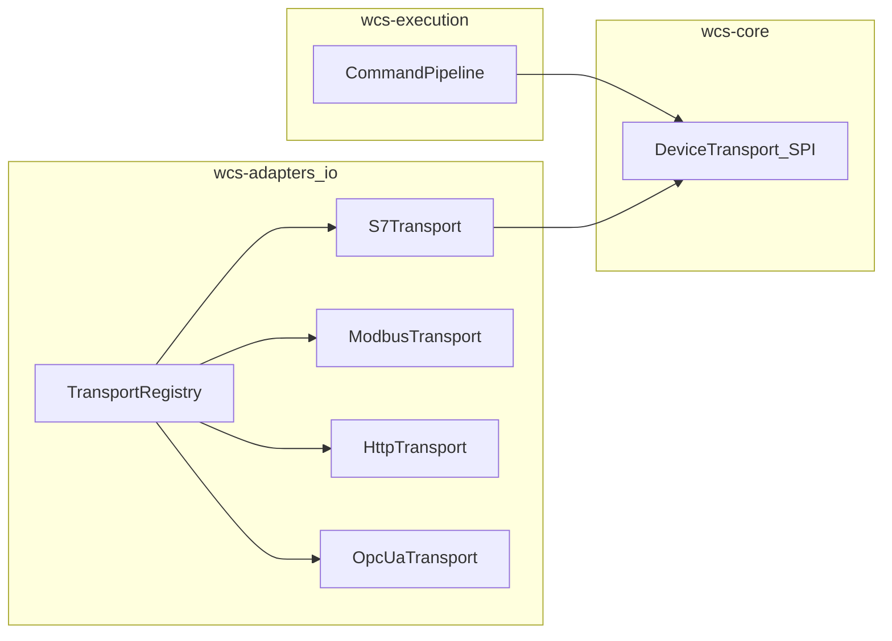

# 设备适配（多协议）开发计划

> **说明**：本文件记录实施规划与阶段划分；**模块职责与接口边界以 `docs/spec/`（尤其 [09-Device-IO-Transport.md](../spec/09-Device-IO-Transport.md)）为准**。实现进度以代码仓库为准。

## 约束与依据

- [docs/spec/06-Module-Structure.md](../spec/06-Module-Structure.md)：**wcs-adapters** 做 S7/Modbus/RCS 等实现；**上层通过 wcs-core 抽象访问**；**wcs-execution** 依赖 adapters 做 IO。
- [docs/spec/02-Architecture.md](../spec/02-Architecture.md)：BPMN 不写协议细节；**幂等与审计**在 execution/infra。
- **连接复用键**：`warehouseId` + **连接端点**（`host` + `port` + 协议必要参数，如 S7 的 `rack`/`slot`）；**deviceId 仅用于寻址/映射**，不默认一对一 TCP。
- **协议策略分治**：长连接+可选心跳（S7/Modbus）、HTTP 无状态连接池（RCS）、OPC UA 长会话+订阅；禁止单一全局心跳套所有协议。

## 建议包结构（新文件夹）

在 [wcs-adapters](../../wcs-adapters) 下新增根包 **`cn.aitplus.wcs.adapters.io`**（与现有 `mqtt` 并列），表示**现场 IO / 工业协议接入**，内部再分：

| 子包 | 职责 |
|------|------|
| `io.connection` | 连接端点模型、池键 `ConnectionKey`（含 warehouseId + 规范化 endpoint）、引用计数或懒建连策略（实现阶段定） |
| SPI 并入 core | 接口在 `wcs-core` 的 `cn.aitplus.wcs.core.spi.device`；**不推荐**长期把 SPI 只放在 adapters |
| `io.registry` | `DeviceTransport` 多实现注册、`CommandDomain -> Transport` 解析 |
| `io.s7` | PLC4X S7：连接管理、读写、可选心跳、重连 |
| `io.modbus` | 后续阶段 |
| `io.http` | RCS（HTTP）等后续阶段 |
| `io.opcua` | 后续阶段（需扩展 `CommandDomain`，并补 docs） |

现有 [wcs-adapters/.../mqtt](../../wcs-adapters/src/main/java/cn/aitplus/wcs/adapters/mqtt) 保持为消息通道示例；**点对点工业 IO** 统一归 `io` 包，与消息类适配并列、语义分离。

## 阶段划分

### 阶段 A — wcs-core 契约（小步、稳定）

- 新增**窄接口**（如 `DeviceTransport`）：入参包含 `warehouseId`、`CommandDomain`、**连接端点 DTO**、**读/写项列表**、超时、调用方传入的**幂等/追踪**字段；出参为统一结果（成功、错误码、响应载荷），**不**依赖 PLC4X/Modbus/HTTP 类型。
- 请求/响应 DTO 与 Command / CommandExecution 字段可对齐，避免 execution 再做大转换。
- **文档**：在 `docs/spec` 增加短节「设备 IO 契约与连接端点键」。

### 阶段 B — wcs-adapters `io` 骨架 + 注册表

- 新建 `io.connection`：`ConnectionKey` 规范化（例如：`warehouseId|protocol|host|port|rack|slot`），`equals/hashCode` 稳定。
- 新建 `io.registry`：Spring 注入 `List<DeviceTransport>`，按 `supports(CommandDomain)` 分发；提供 **facade Bean** 供 execution 单点注入。
- [wcs-adapters/pom.xml](../../wcs-adapters/pom.xml)：加 **spring-context**（若尚无）与后续 PLC4X；**不**引入与具体协议无关的冗余 starter。

### 阶段 C — S7 首个可运行实现（长连接）

- 依赖父 POM 已管理的 **PLC4X**（`plc4j-api`、`plc4j-driver-s7`）。
- `io.s7`：**每 `ConnectionKey` 一条（或小池）长连接**；断线重连（退避）；可选**配置化心跳**。
- `@ConfigurationProperties`（如 `wcs.adapter.s7`）类放在 adapters；**YAML 放在** [wcs-app/src/main/resources/application.yml](../../wcs-app/src/main/resources/application.yml)。
- **单元测试**：连接键合并逻辑等。

### 阶段 D — Modbus / HTTP(RCS) / OPC UA

- **Modbus**：长连接 + 轮询读写；Unit ID 在**请求级**携带，键仍以 TCP 端点为主。
- **HTTP**：`RestTemplate`/`WebClient` 连接池；无应用层心跳。
- **OPC UA**：会话 + 订阅；**先**在 docs 与 `CommandDomain` 中增加 **OPC**（或等价命名）再实现。

### 阶段 E — wcs-execution 接线

- 在 [wcs-execution](../../wcs-execution) 实现 CommandPipeline「下发」步：`domain -> registry.execute(...)`，并写回 [CommandExecutionService](../../wcs-infra/src/main/java/cn/aitplus/wcs/infra/service/execution/CommandExecutionService.java)（沿用现有 infra 边界，不直接 Mapper）。

## 风险与顺序说明

- **execution 仍空**：阶段 A–C 可先交付「可测 S7 + 注册表」；阶段 E 与 pipeline 同迭代或紧随其后。
- **CommandDomain 与 OPC**：与文档同步后再加枚举。
- **JetCache / 缓存**：设备连接池**不走**流程定义类 JetCache；配置热更新若需另议。

## 交付物清单（摘要）

| 阶段 | 交付 |
|------|------|
| A | core 接口 + DTO + docs 小节 |
| B | `adapters.io` 包、`ConnectionKey`、Registry Bean |
| C | S7 实现 + yml 示例 + 测试 |
| D | Modbus / HTTP / OPC（按需排期） |
| E | execution 调用 registry + 审计回写 |

---

与 [06-Module-Structure.md](../spec/06-Module-Structure.md) 中 wcs-adapters / wcs-execution 职责一致。
